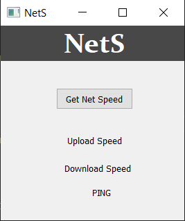
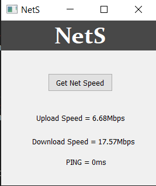

# Net-S 📡

> A simple widget made with python, to track your internet speed.
> Net-S uses the python library **speedtest-cli** to track your internet connection and provide appropriate results releated to download and upload speed, along with PING response time.

## Dependencies🛠

> For the program to work efficiently you need to install the following dependencies:

``` 
  pip install speedtest-cli
  pip install PyQt5
  
```
## Interface🎞



> Getting details



## Interpreting PING:

>Packet Internet Groper, commonly abbreviated as PING, is a diagnostic tool that tests connectivity between two nodes or devices across a network. PING verifies whether or not a network data packet is capable of being distributed to an address without having errors.

>The following are considered as a good ping response time:
  - 30 ms – excellent ping and ideal for online gaming.
  - 30 to 50 ms – average ping and still good for online gaming.
  - 50 to 100 ms – somewhat slow ping time and this affects online gaming.
  - 100 to 500 ms – slow ping and only has minimal effect on web browsing but creates a noticeable lag in online gaming.
  - 500 ms – pings of a half second or more will add a noticeable delay to all requests.
